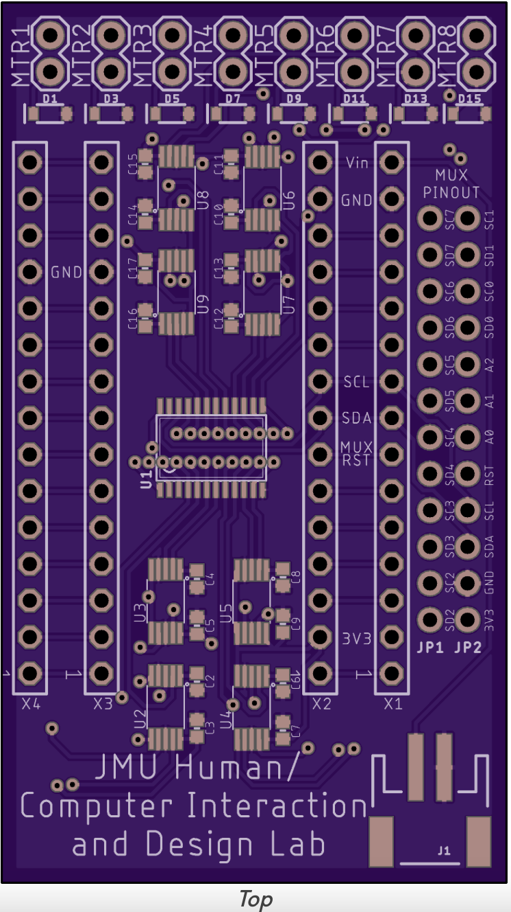
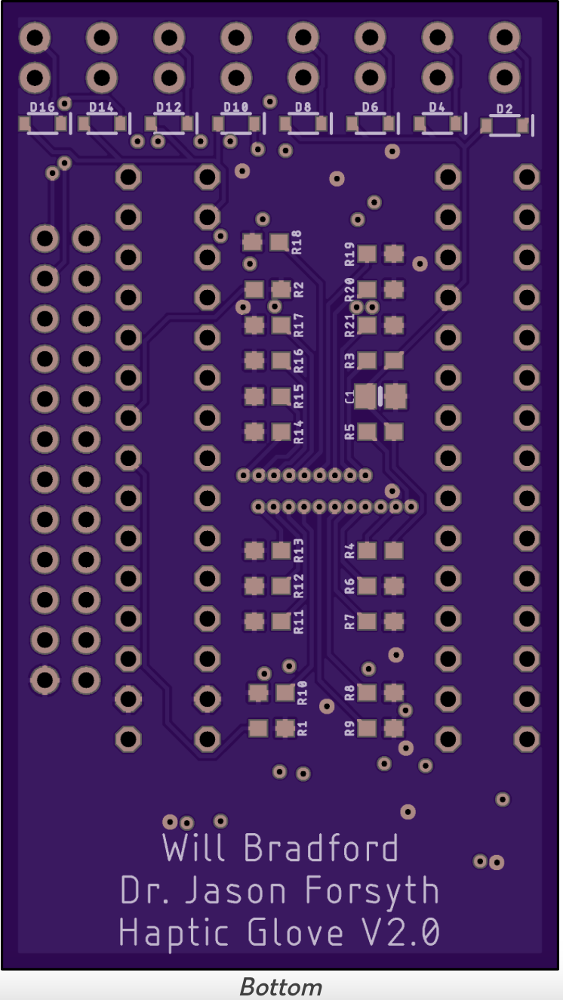

# haptic-glove

## PCB

### Schematic
TODO

### Layout

#### PCB Edit History
##### V2.0
- Initial board redesign
##### V2.1 (TODO)
- Changed part J1 to be an accurate JST-PH connector
- (TODO) Shifted Arduino placement to allow for more clearance between the Arduino and the motor headers
- (TODO) Implemented graphic to denote onboard IMU directions
- (TODO) Added a spot to write the board's device ID
- (TODO) Shifted some silkscreen placements so that text is not cut off by pads
  
## Eagle PCB Set-Up

### OSHPark Plugin
The OSHPark Eagle plugin includes OSHPark design rules and allows the user to send the .brd file directly to an OSHPark cart. See the OSHPark-Eagle-Tools GitHub: https://github.com/OSHPark/OSHPark-Eagle-Tools

### Libraries
Included in the repository are:
1. TCA9548APWR.lbr (I2C multiplexer)
2. SparkFun-Eagle-Libraries-main.zip

## Arduino Nano Arduino IDE setup 

### Correct board type:
Arduino NANO 33 IoT

### Arduino Libraries
 
1. Adafruit_DRV2605.h
2. Arduino_LSM6DS3.h
3. WiFiNINA.h

## Communicating with Nano 33 IoT

Nano 33 IoT can be communicated with via TCP socket connection.
Network credentials can be modified with the "ssid" and "password" variables within the Arduino code.
When booted, the Nano 33 IoT establishes a user definable static IP.

### Onboard LED state meanings
|State|Meaning|
--- | --- |
|OFF|Not connected to network|
|BLINKING|Connected to user specified network (not currently implemented)|
|SOLID|TCP client connected and ready for messages|

### Message format
Messages follows the format: X,n01,n02,n03,n04,n05,n06,n07,n08

X is a char that signifies the message type. nXX is a number.
Negative numbers will be ignored and the playback of the current haptic effect will continue.
0 will stop the corresponding driver.
For messages of type 'E', numbers [1, 123] will set the playback effect of the corresponding driver.
Numbers higher than 123 will set the playback effect to effect # 123
All decimals will be rounded DOWN
Each segment of the message correspondes to the strength of a specific haptic driver.
Where n01 controls driver 1, n02 controls driver 2, and so on.
