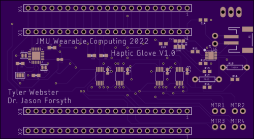
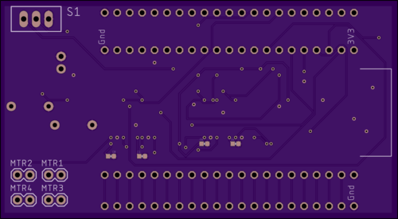

# haptic-glove

## Wiring diagram
TODO

## Circuit board

## ESP32 Arduino IDE setup 

### Guide:
https://docs.espressif.com/projects/arduino-esp32/en/latest/installing.html

### Board manager URL:
https://raw.githubusercontent.com/espressif/arduino-esp32/gh-pages/package_esp32_dev_index.json

### Correct board type:
ESP32S2 Native USB

### Arduino Libraries
Included within repo:  
1. Adafruit_NeoPixel.h
2. Adafruit_DRV2605.h

## Communicating with ESP32

ESP32 can be communicated with via TCP socket connection.  
Network credentials can be modified with the "ssid" and "password" variables within the Arduino code.  
When booted, the ESP32 establishes a user definable static ip.  

### Onboard LED color meanings
|Color|Meaning|
--- | --- |
|RED|Not connected to network|
|BLUE|Connected to user specified network|
|GREEN|TCP client connected and ready for messages|

### Message format
Messages follows the format: /n01/n02/n03/n04  
nXX is a number of length 3 between 0 and 255.
Each segment of the message correspondes to the strength of a specific motor.
Where n01 controls motor 1, n02 controls motor 2 and so on.
